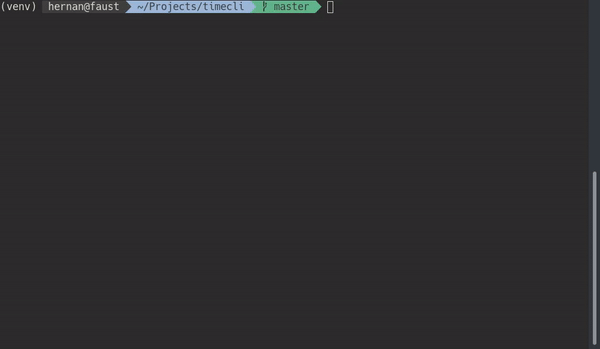

# timecli

timecli is a CLI-App that help you manage the time expend in your daily tasks.



## Getting Started

```
$ git clone https://github.com/hfvaldesg/timecli.git
$ cd timecli
$ python3 -m venv venv
$ source venv/bin/activate
(venv) $ pip3 install -r requirements.txt
(venv) $ python main.py -h
```

## Built With

* Python3
* SQLAlchemy

## License

This project is licensed under the GNU GPL version 3 &mdash; see the [LICENSE](LICENSE) file for details